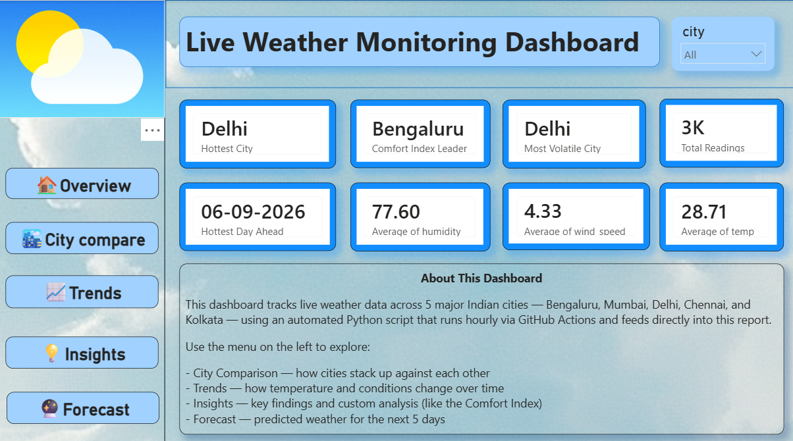
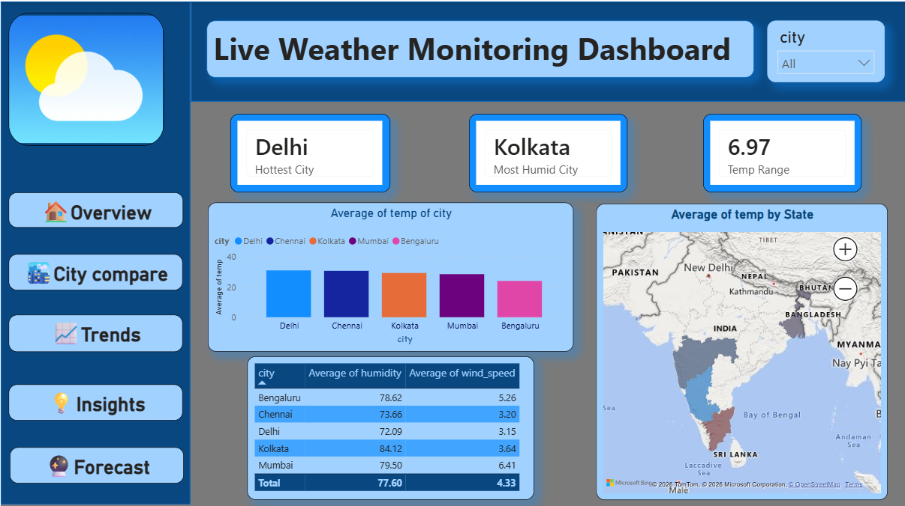
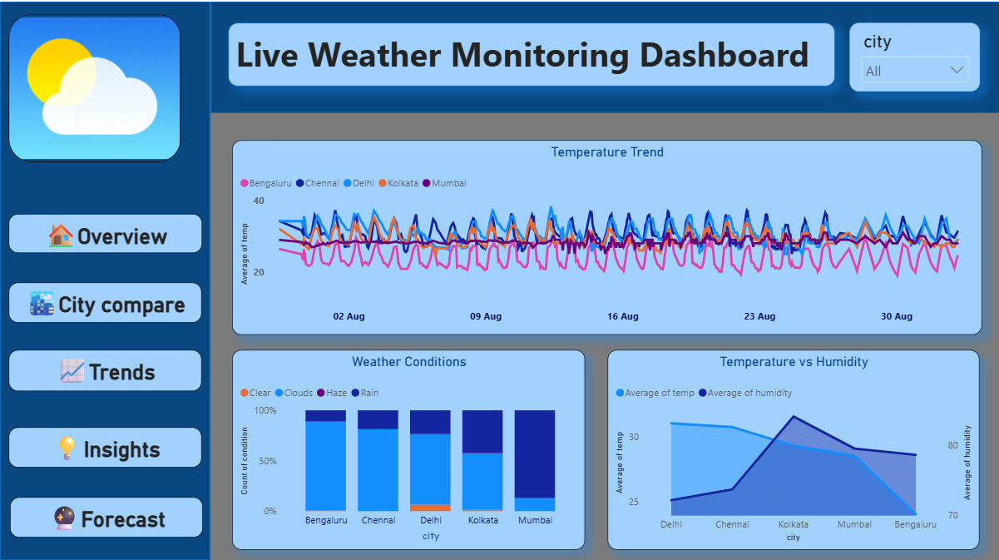
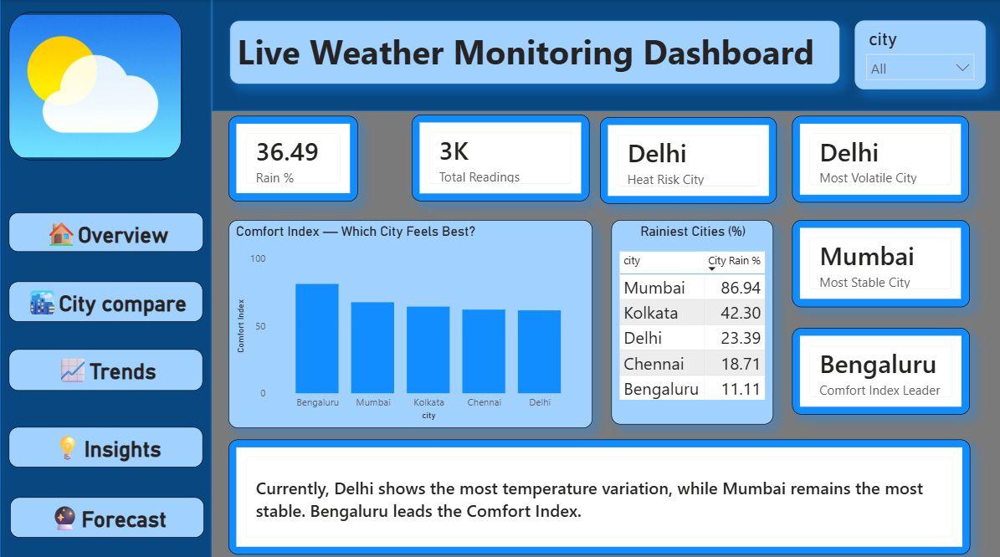
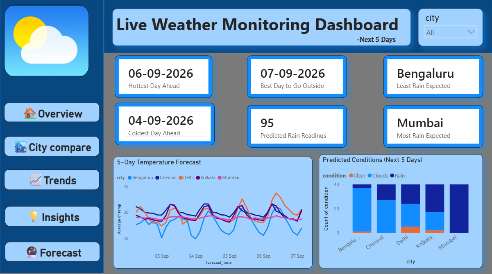

# Live Weather Monitoring Dashboard

An automated data pipeline + Power BI dashboard tracking live weather across 5 major Indian cities (Bengaluru, Mumbai, Delhi, Chennai, Kolkata).

## How it works
- A Python script fetches live weather data from the OpenWeatherMap API
- GitHub Actions runs the script automatically every hour, logging data to `weather_log.csv`
- A second script fetches 5-day forecast data into `forecast_log.csv`
- Power BI connects directly to these GitHub-hosted CSVs

## Tech Stack
Python, OpenWeatherMap API, GitHub Actions, Power BI (Power Query, DAX)

## Dashboard Preview

### Overview

### City Comparison

### Trends

### Insights

### Forecast

